## Part 1. Инструмент ipcalc
### 1.1. Сети и маски

- Определяем адрес сети 192.167.38.54/13 с помощью команды:
    - ipcalc 192.167.38.54/13
- Переводим маску в другие формы записи с помощью команд:
    - ipcalc 192.167.38.54/255.255.255.0
        - Префиксная форма записи: /24
        - Двоичная форма записи: 11111111.11111111.11111111.00000000
    - ipcalc 192.167.38.54/15
        - Обычная форма записи: 255.254.0.0
        - Двоичная форма записи: 11111111.11111110.00000000.00000000

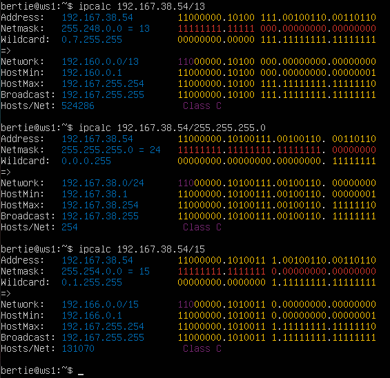

*pic.1. Сети и маски. ipcalc 192.167.38.54/13; ipcalc 192.167.38.54/255.255.255.0; ipcalc 192.167.38.54/15*

- Для маски вида 11111111.11111111.11111111.11110000 команда выглядит следующим образом:
    - ipcalc 192.167.38.54/11111111.11111111.11111111.11110000
        - Обычная форма записи: 255.255.255.240
        - Префиксная форма записи: /28

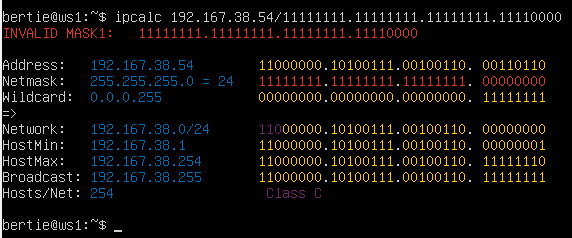

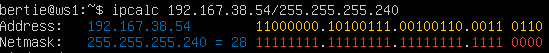

*pic.2-3. Сети и маски. ipcalc 192.167.38.54/11111111.11111111.11111111.11110000; ipcalc 192.167.38.54/255.255.255.240*

- Определяем минимальный и максимальный хост в сети 12.167.38.4 при масках: /8, 11111111.11111111.00000000.00000000, 255.255.254.0 и /4 с помощью команд:
    - ipcalc 12.167.38.4/8
        - Минимальный хост: 12.0.0.1
        - Максимальный хост: 12.255.255.254

    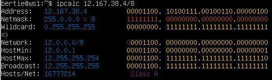

*pic.4. Сети и маски. ipcalc 12.167.38.4/8*

    - ipcalc 12.167.38.4/11111111.11111111.00000000.00000000 = ipcalc 12.167.38.4/255.255.0.0
        - Минимальный хост: 12.167.0.1
        - Максимальный хост: 12.167.255.254

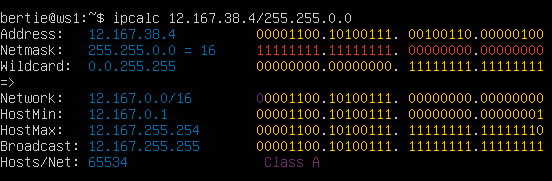

*pic.5. Сети и маски. ipcalc 12.167.38.4/255.255.0.0*

    - ipcalc 12.167.38.4/255.255.254.0
        - Минимальный хост: 12.167.38.1
        - Максимальный хост: 12.167.39.255

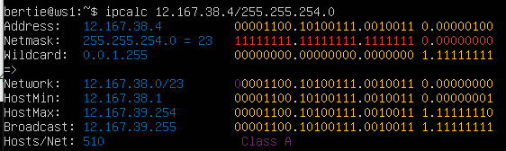

*pic.6. Сети и маски. ipcalc 12.167.38.4/255.255.254.0*

    - ipcalc 12.167.38.4/4
        - Минимальный хост: 0.0.0.1
        - Максимальный хост: 15.255.255.254

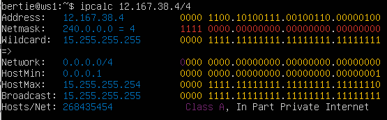

*pic.7. Сети и маски. ipcalc 12.167.38.4/4*

### 1.2. localhost
- Для localhost зарезервированы адреса 127.0.0.0 — 127.255.255.255

- Проверяем командами:
    - ipcalc 127.0.0.2 | grep Hosts
    - ipcalc 127.1.0.1 | grep Hosts
    - ipcalc 194.34.23.100 | grep Hosts
    - ipcalc 128.0.0.1 | grep Hosts

    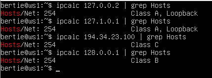

*pic.8. Localhosts. Проверка ip для localhosts. Порты, где указано Loopback - порты для localhosts*

### 1.3. Диапазоны и сегменты сетей

- Для проверки какие адреса частные, какие публичные, используем команды:
    - ipcalc 10.0.0.45 | grep Hosts
    - ipcalc 134.43.0.2 | grep Hosts
    - ipcalc 192.168.4.2 | grep Hosts
    - ipcalc 172.20.250.4 | grep Hosts
    - ipcalc 172.0.2.1 | grep Hosts
    - ipcalc 192.172.0.1 | grep Hosts
    - ipcalc 172.68.0.2 | grep Hosts
    - ipcalc 172.16.255.255 | grep Hosts
    - ipcalc 10.10.10.10 | grep Hosts
    - ipcalc 192.169.168.1 | grep Hosts

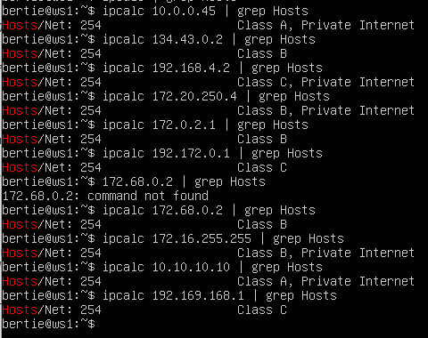

*pic.9. Проверка приватности адресов.*

- Таким образом приватными являются:
    - 10.0.0.45
    - 192.168.4.2
    - 172.20.250.4
    - 172.16.255.255
    - 10.10.10.10
- Общественными являются:
    - 134.43.0.2 
    - 172.0.2.1
    - 192.172.0.1
    - 172.68.0.2
    - 192.169.168.1

- Для проверки какие из перечисленных шлюзов возможны у сети 10.10.0.0/18 используем команду:
    - ipcalc 10.10.0.0/18

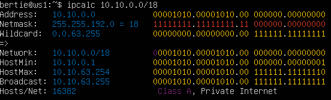

*pic.10. Проверка наличия адресов.*

- В указанный диапозон адресов попадают:
    - 10.10.0.2
    - 10.10.10.10
    - 10.10.1.255

## Part 2. Статическая маршрутизация

- Для двух машин установили имена ws1 и ws2 с помощью команды **sudo hostnamectl set-hostname**

- Проверяем существующие сетевые интерфейсы с помощью команды **ip a**

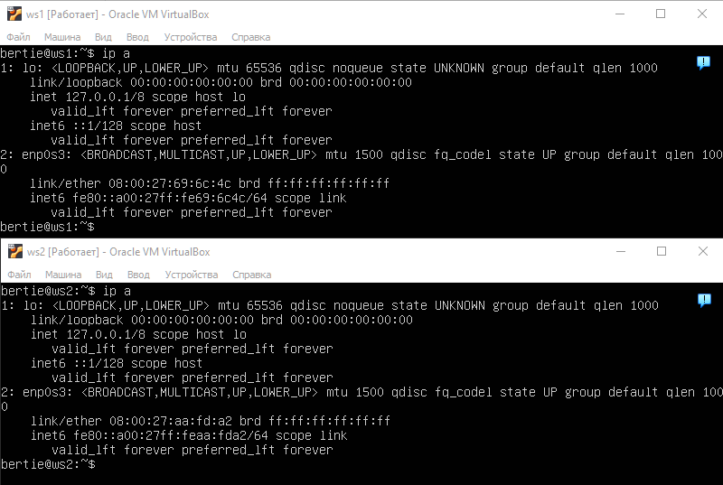

*pic.11. Проверка сетевых интерфейсов*

- Проверяем текущую адресацию машин с помощью команды **netstat -nr**
    - **n** отвечает за отбражение адресов в числовом виде
    - **r** отвечает за отображение информайии в виде таблицы

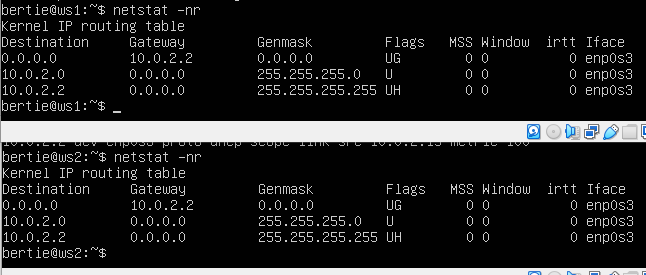

*pic.12. Проверка адресов машин*

- Для задания адресов машин вручную необходимо поменять на каждой из них файл etc/netplan/00-installer-config.yaml в удобном редакторе

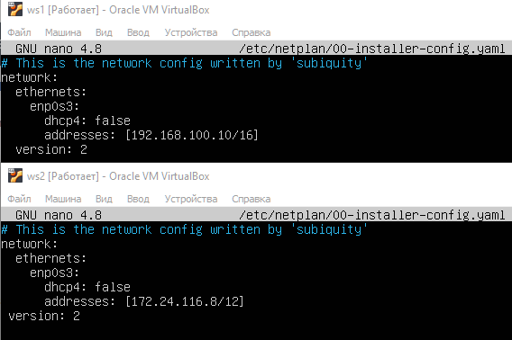

*pic.13. Задание адресов*

- Для перезапуска сервиса сети используем команду **netplan apply**

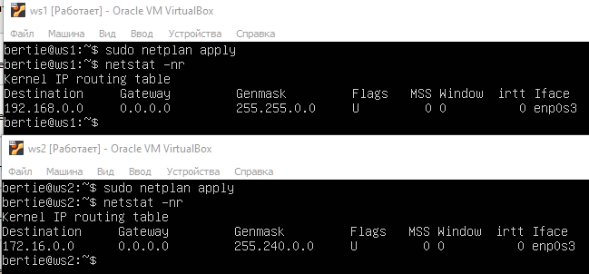

*pic.14. Перезапуск службы сети*

- Для проверки ip адресов используем команду **ip a** на каждой машине

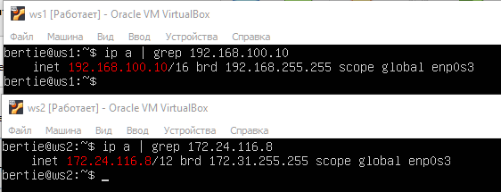

*pic.15. Установленные ip адреса*

### 2.1. Добавление статического маршрута вручную

- Добавляем адреса с помощью команд **sudo ip route add 172.24.116.8 dev enp0s3** и **sudo ip route add 192.168.100.10 dev enp0s3**

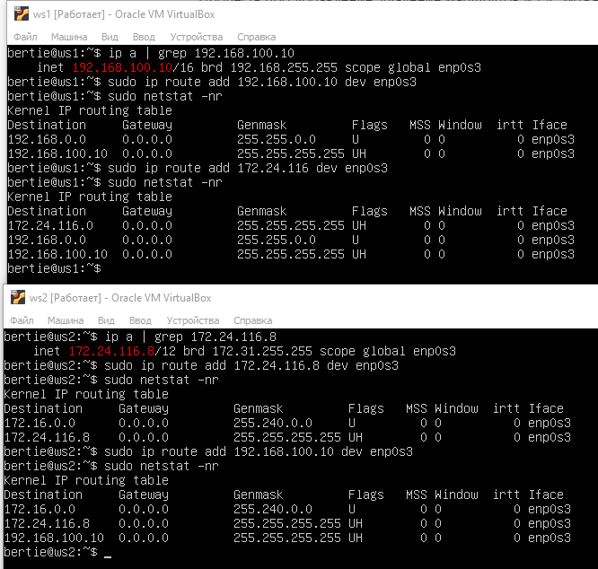

*pic.16. Добавления адресов для статического маршрута*

- Проверяем с помощью команды **ping -c 5 [ip-address]**

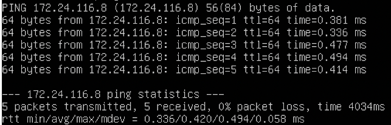
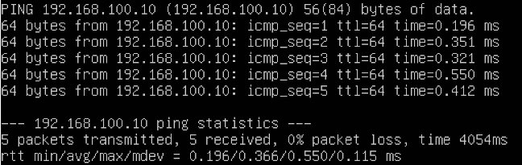

*pic.17-18. маршрутизация*

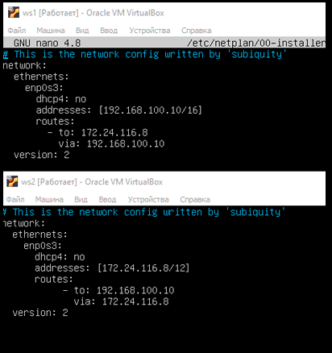

*pic.19. Добавления постоянных маршрутов*

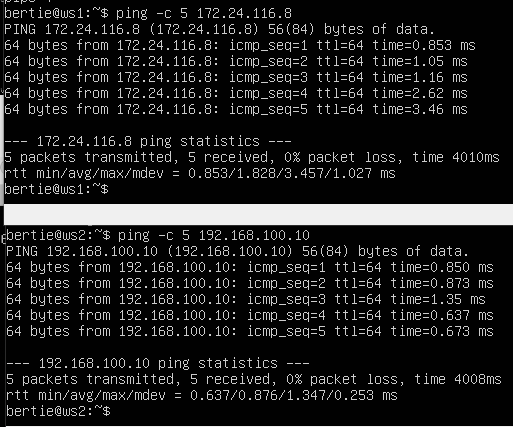

*pic.20. маршрутизация*

## 3. Утилита iperf3

### 3.1. Скорость соединения

- Переводим из одних единиц измерения в другие:

    - 8 Mbps (мегабит в секуду) = 1 MB/s (мегабайт в секунду)

    - 100 MB/s (мегабайт в секунду) = 800 000 Kbps (килобит в секунду)

    - 1 Gbps (гигабит в секунду) = 1 000 Mbps (мегабит в секунду)

### 3.2. Утилита iperf

- Для определения скорости соединение запускаем:
    - На станции ws1 сервер с помощью команды: **iperf3 -s**
    - На станции ws2 клиент с помощью команды: **iperf3 -c 192.168.100.10**

    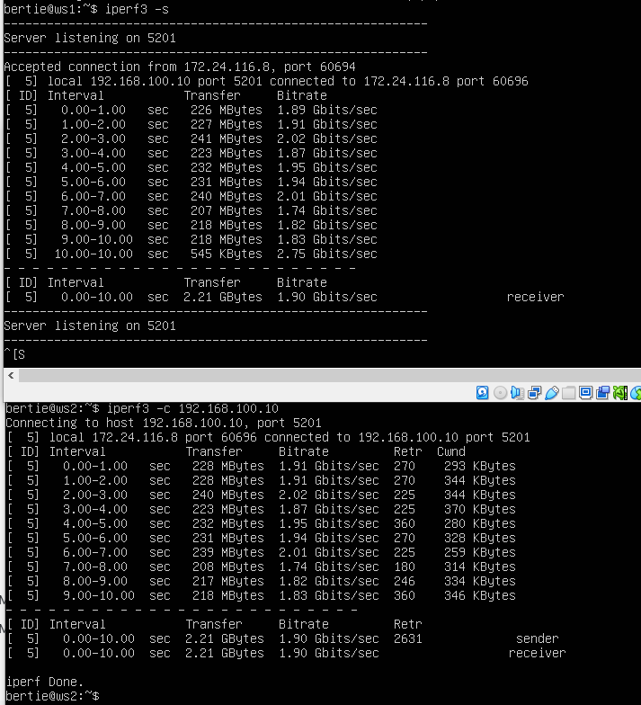

    *pic.21. Определение скорости с помощью iperf3*

## Part 4. Сетевой экран

### 4.1. Утилита iptables

- Создаём скрипты по указанным в заданиям правилам

    - На ws1 примени стратегию, когда в начале пишется запрещающее правило, а в конце пишется разрешающее правило (это касается пунктов 4 и 5).

    - На ws2 примени стратегию, когда в начале пишется разрешающее правило, а в конце пишется запрещающее правило (это касается пунктов 4 и 5).

    - Открой на машинах доступ для порта 22 (ssh) и порта 80 (http).

    - Запрети echo reply (машина не должна «пинговаться», т. е. должна быть блокировка на OUTPUT).

    - Разреши echo reply (машина должна «пинговаться»).

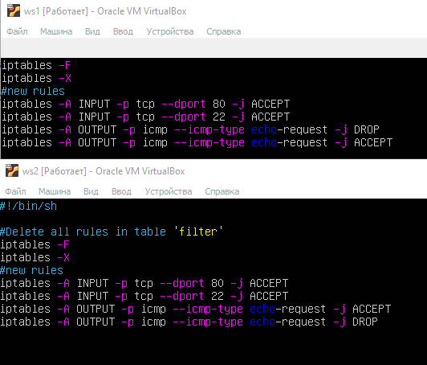

*pic.22. Созданные скрипты*

- Запускаем скрипты командами *chmod +x /etc/firewall.sh* и */etc/firewall.sh*

- В результате первая машина не может пропинговать вторую:

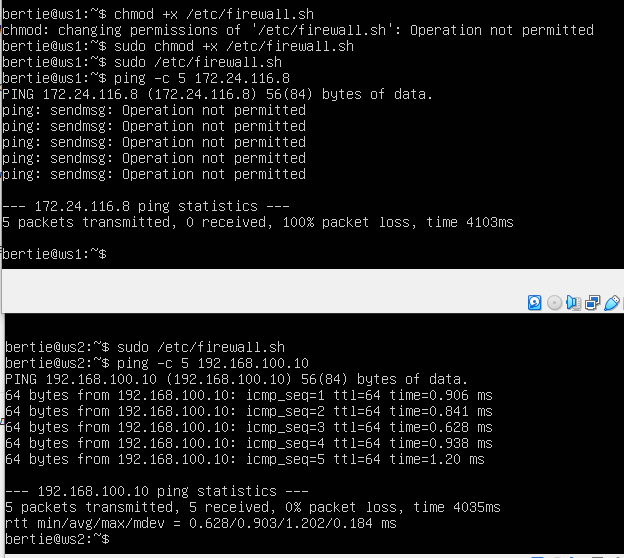

*pic.23. Результат работы фаервола*

### 4.2. Утилита nmap

- Используем **nmap** на ws1 и убеждаемся в наличии строки *Host is up*

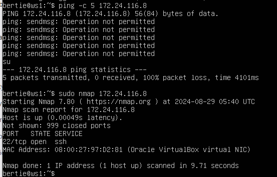

*pic.24. Использование nmap на ws1*

## 5. Статическая маршрутизация сети

### 5.1. Настройка адресов машин

- Настройки адресации для r1 и r2

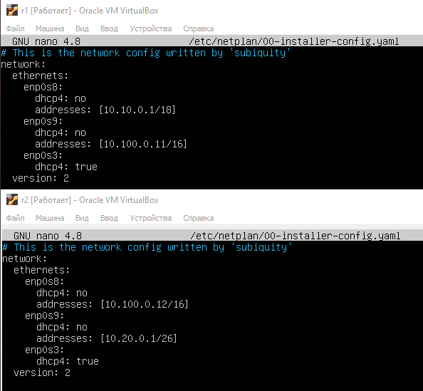

*pic.25. Адресация роутеров*

- Настройка адресации ws11, ws21 и ws22:

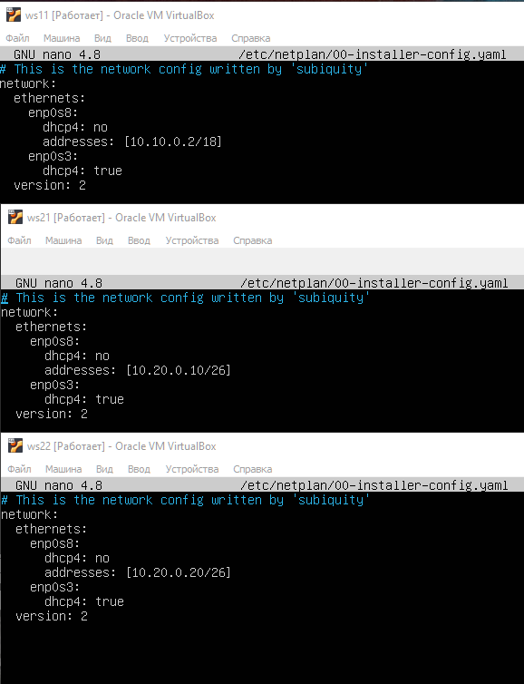

*pic.2. Адресация рабочих станций*

- Проверка адресов рабочих станций:

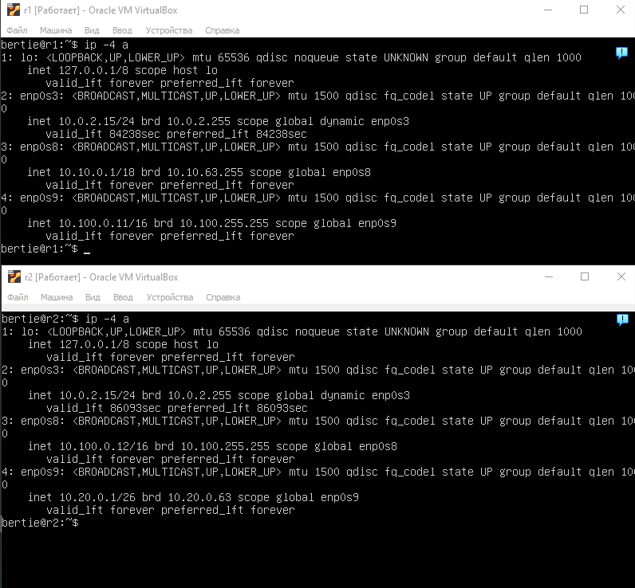
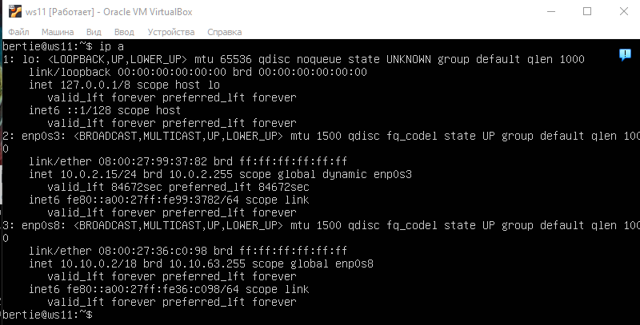
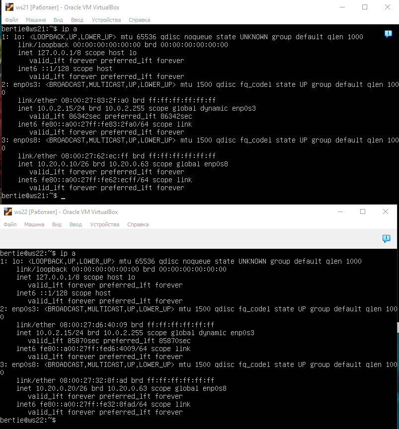

*pic.27-29. Проверка правильности адресации ребочих станций*

- Пинги r1 с ws11, ws22 с ws21

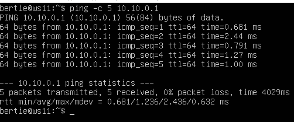
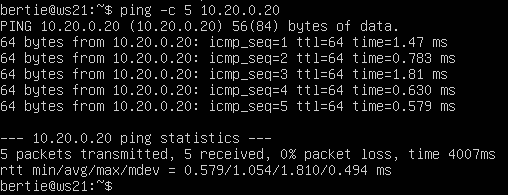

*pic.30-31. Пинги машин*

### 5.2. Включение переадресации адресов

- Выполняем команду на роутерах: **sudo sysctl -w net.ipv4.ip_forward=1**

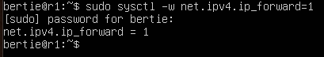
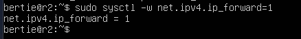

*pic.32-33. Включение переадресации на роутерах*

- Для того чтобы оно работало после перезапуска, необходимо открыть файл **/etc/sysctl.conf** и раскомментировать строчку **net.ipv4.ip_forward = 1**

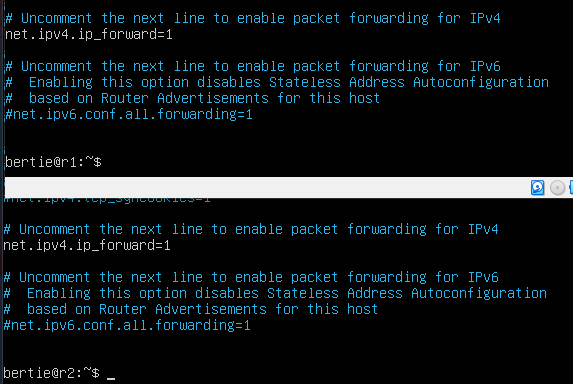

*pic.34. Включение переадресации на постоянной основе*

### 5.3. Установка маршрутов по умолчанию

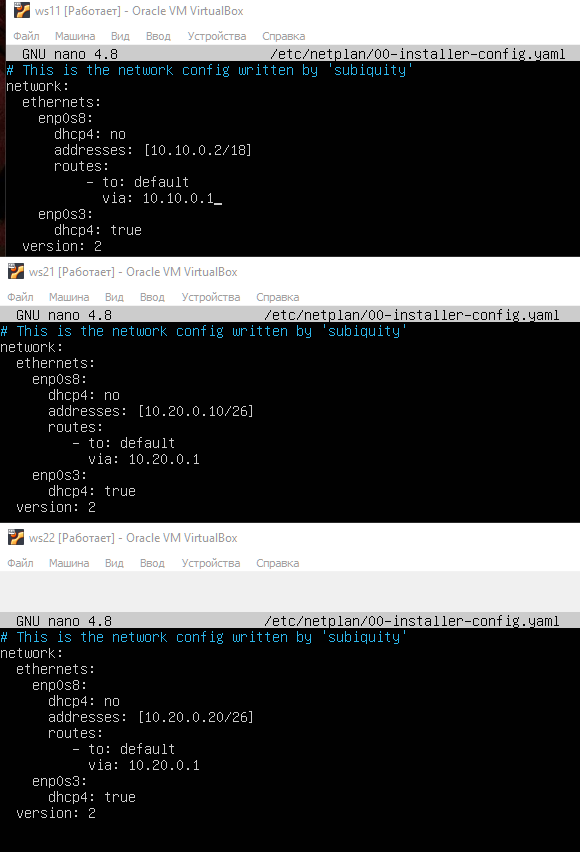

*pic.35. Установка маршрутов по уморчанию для рабочих станций*

- Проверяем правильность исполенения:

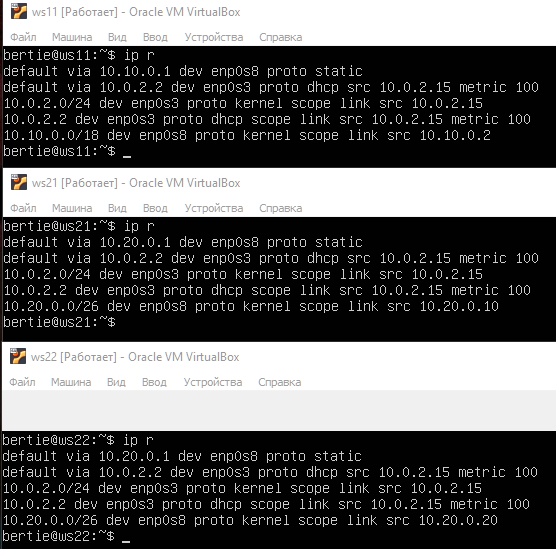

*pic.36. Записи об установке маршрутов по умолчанию*

- Прослушиваем на роутере r2 машину ws11:

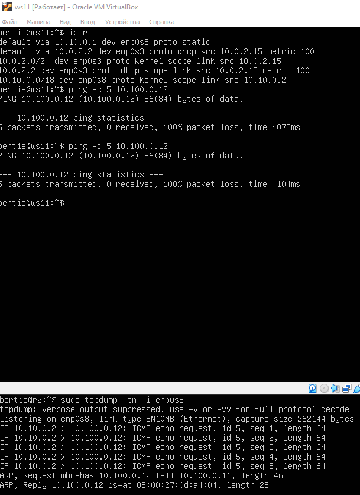

*pic.37. Прослушка на r2*

### 5.4. Добавление статических маршрутов

- Добавляем в файл **/etc/netplan/00-installer-config.yaml** для каждого роутера новые маршруты:

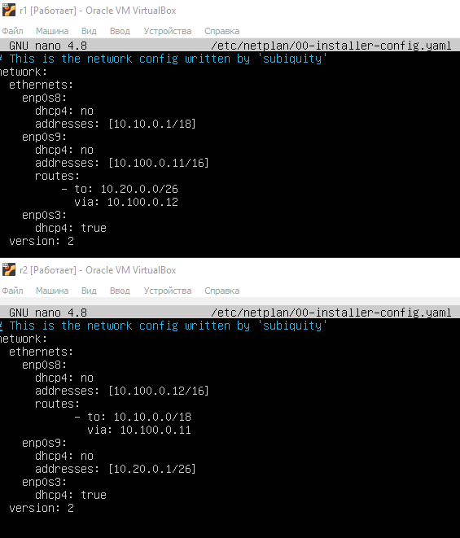

*pic.38. Добавление на роутеры статических маршрутов*

- Проверяем их наличие командой **ip r**

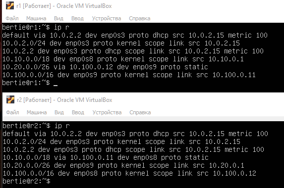

*pic.39. Проверка установки маршрутизации*

- Проверка через запуск на машине ws11 команд **ip r list 10.10.0.0/18** и **ip r list 0.0.0.0/0**

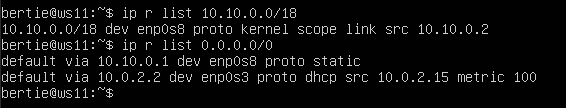

*pic.40. ПРоверка на ws11*

### 5.5. Построение списка маршрутизаторов

- Запуск утилиты traceroute на ws11 и прослушки на r1:

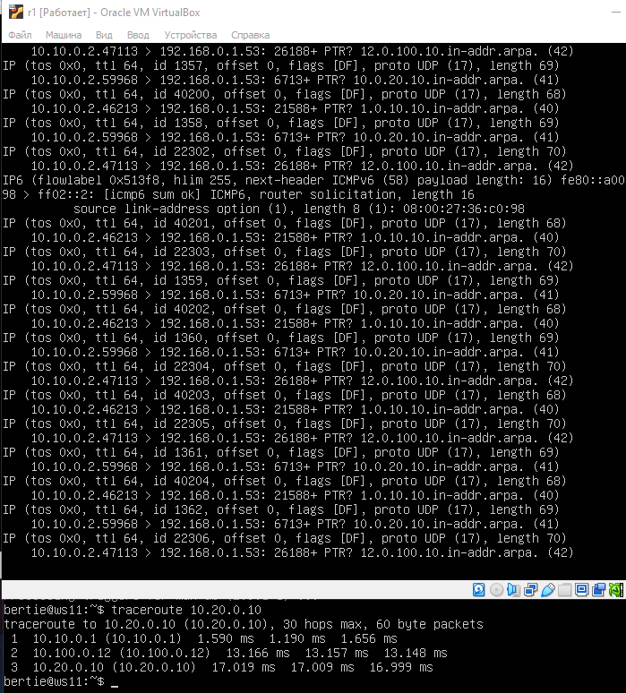

*pic.41. Утилита traceroute и прослушка*

- Вывод:
    - Каждый пакет проходит на своём пути множество узлов, но у него есть время жизни - количество узлов, которое он может пройти. Этот параметр прописан в заголовке пакета и каждый узел его перезаписывает. Как только оно достигает нуля, пакет уничтожается, а пользователю приходит ответ Time Exceeded.

    - Команда traceroute отправляет пакеты каждый раз с увеличивающимся временем жизни. Таким образом он сначала получает данные о первом ближайшем узле, потом - о втором. И далее. До тех пор пока не получит ответ что пакет доставлен по месту назначения.

### 5.6. Использование протокола ICMP

- Пинг несуществующей машины:

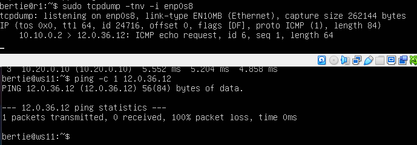

*pic.42. Пинг несуществующей машины*

## 6. Динамическая настройка IP с помощью DHCP

### Настройка DHCP на r2

- Дописываем файл **/etc/dhcp/dhcpd.conf** на r2

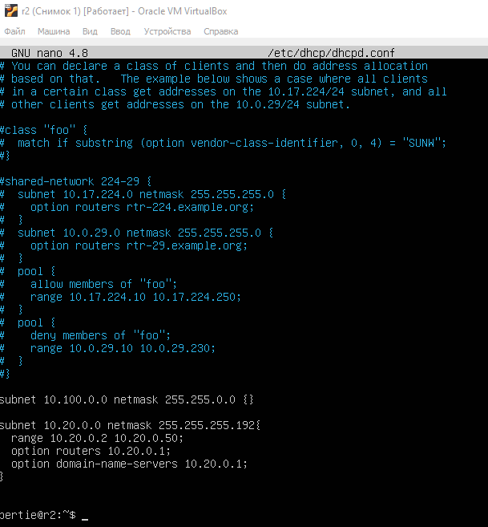

*pic.43. Изменения на r2 в файле /etc/dhcp/dhcpd.conf*

- Изменяем файл **/etc/resolv.conf**

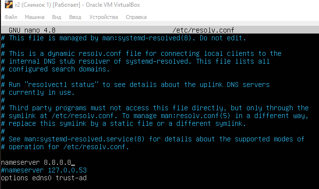

*pic.44. Изменения в файле /etc/resolv.conf*

- Проверяем получение машиной ws21 нового ip и проверяем пинг машиной роутера и ws22:

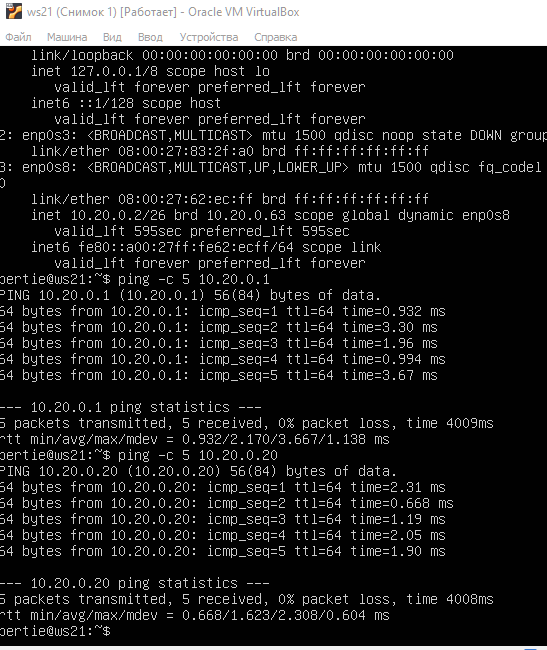

*pic.45. Проверка работы службы DHCP на r2*

### Указание MAC-адресов

- Указываем MAC-адрес для ws11

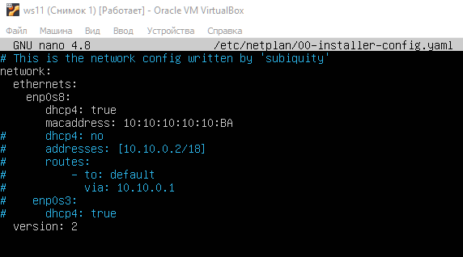

*pic.46. Указываем MAC-адрес для ws11*

- Настраиваем r1:

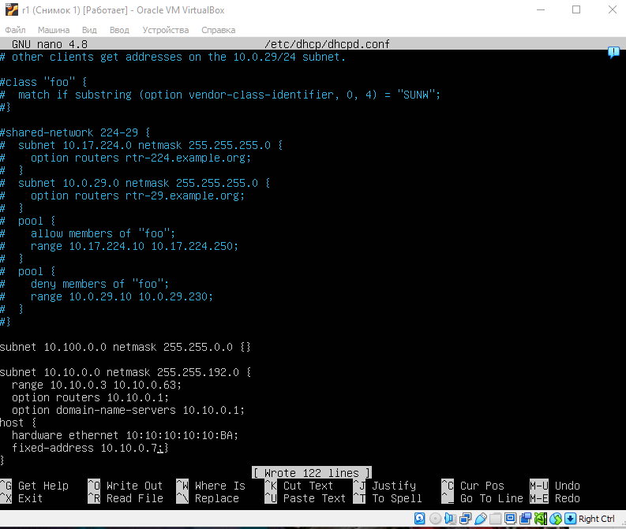
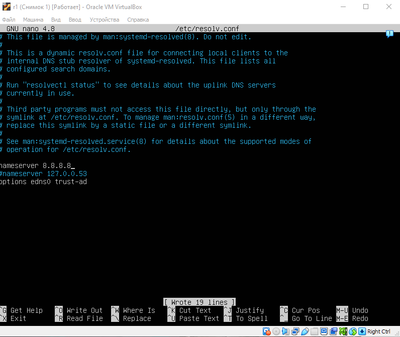

*pic.47-48. Настройка r1*

- Проверка запуска службы после рестарта:

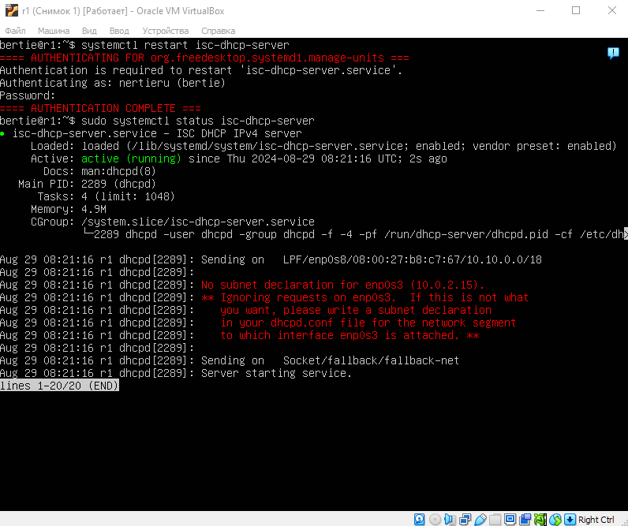

*pic.49. Поднимаем службу DHCP на r1*

- После установки MAC-адреса для виртуальной машины и всех манипуляций проверяем **ip a** для ws11

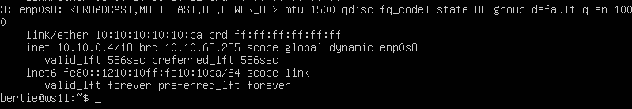

*pic.50. Проверка обновлённого адреса ws11*

- Пропингуем машину ws22:

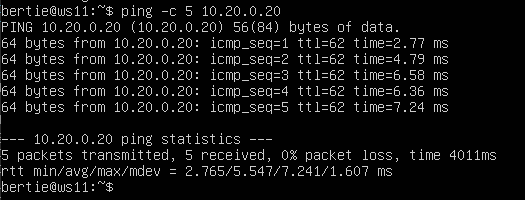

*pic.51. Пинг ws22*

- Проверяем возможность получения ws21 нового адреса

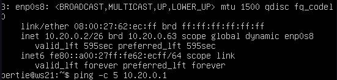
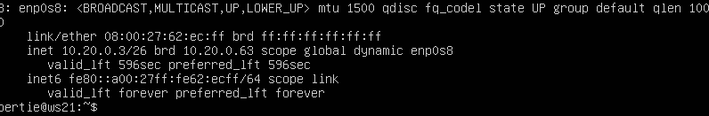

*pic.52-53. Старый и новый ip-адрес ws21*

- Были использованы следующие опции DHCP протокола:

    - option routers ip-address [, ip-address...]; - адреса шлюзов для клиентской сети. Маршрутизаторы должны быть перечислены в порядке предпочтительности.

    - option domain-name-servers ip-address [, ip-address...]; - Список DNS серверов доступных клиенту. Сервера должны быть перечислены в порядке предпочтительности.
## 7. NAT

- На r1 и ws22 делаем Apache общедоступным

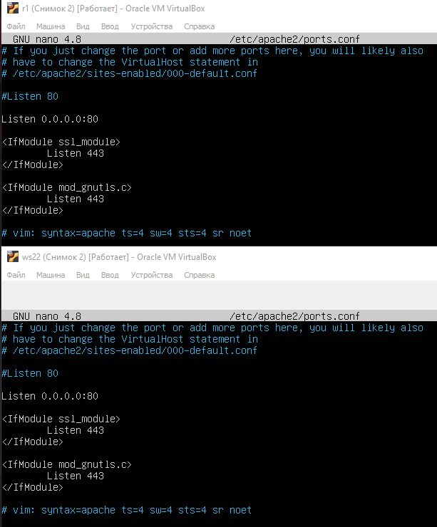

*pic.54. Apache2 делаем доступным на r1 и ws22*

- Запускаем Apache2 на r1 и ws22

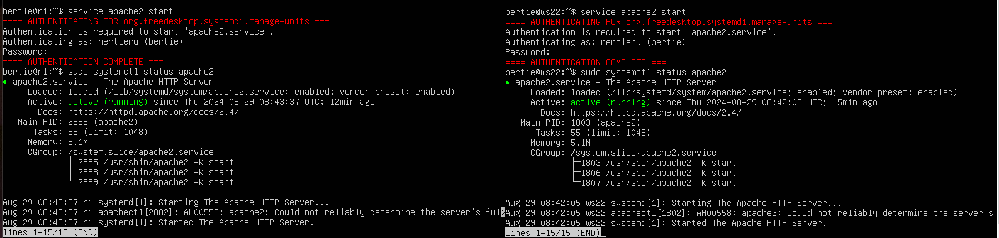

*pic.55. Запуск Apache на r1 и ws22*

- Добавляем фаервол на r2

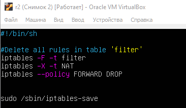

*pic.56. Фаервол*

- Пытаемся пинговать ws22 с r1 и обратно:

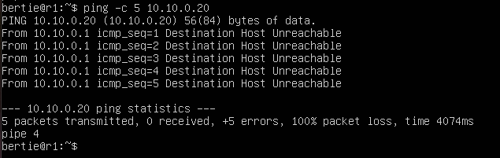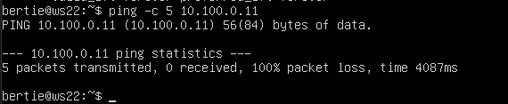

*pic.57-58. Провальный пинг ws22 с r1 и обратно*

- Меняем настройки фаервола:

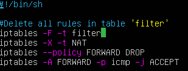

*pic.59 Добавляем строку в фаервол*

- Пытаемся обратиться с r1 на ws22:

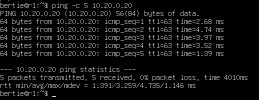

*pic.60. Обращение к ws22 после настройки фаервола*

- Добавляем новые правила для фаервола, помня что:
Значения использованных опций:

    - t - указывает на используемую таблицу;

    - p - указывает протокол, такие как tcp, udp, udplite и другие, поддерживаемые системой, ознакомиться со списком можно в файле /etc/protocols;

    - m - подключает указанный модуль;

    - s - указывает адрес источника пакета, в качестве значения можно указать как один IP-адрес, так и диапазон;

    - i - задает входящий сетевой интерфейс;

    - o - указывает исходящий сетевой интерфейс;

    - --dport - порт получателя пакета;

    - DNAT — подменяет адрес получателя в заголовке IP-пакета, основное применение — предоставление доступа к сервисам снаружи, находящимся внутри сети;
    
    - SNAT — служит для преобразования сетевых адресов, применимо, когда за сервером находятся машины, которым необходимо предоставить доступ в Интернет, при этом от провайдера имеется статический IP-адрес.

- Подключаемся с ws22 к r1 и проверка пингом:

    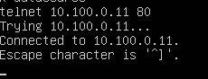
    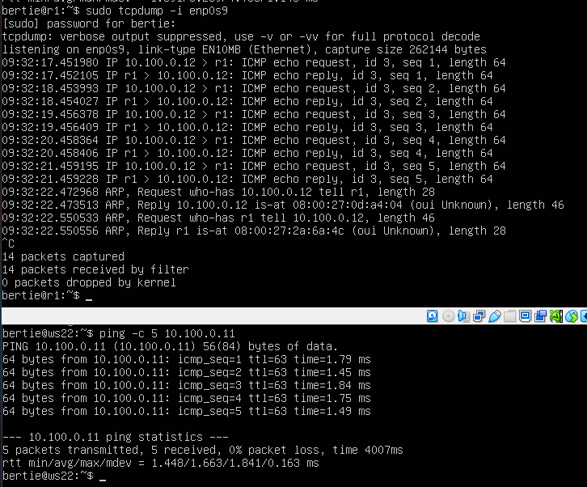

    *pic.61-62. Успешное подключение ws22 к r1 и проверка подключения*

    - Проверка обратного подключения:

    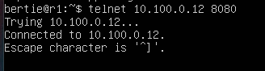

    *pic.63. Проверка обратного подключения*

    ## 8. Дополнительно. SSH Tunnels

    - Меняем настройки Apache2 для ws22:

    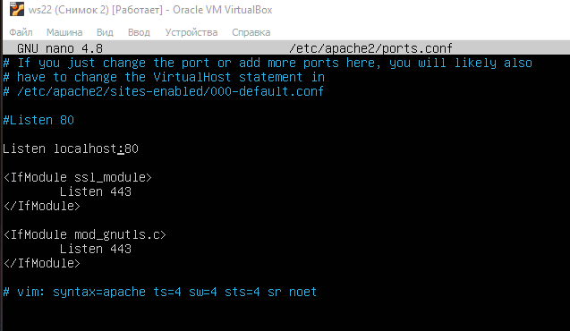

    *pic.64. Новые настройки Apache2*

    - Проверяем процессы, запущенные на ws22:

    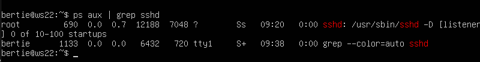

    *pic.65. Проверка запущенных процессов*

    - Запускаем ssh 10.20.0.20:

    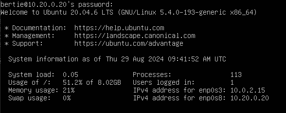

    *pic.66. Результат запуска ssh на ws22*

    - Запуск соединения с ws22 от лица ws21:

    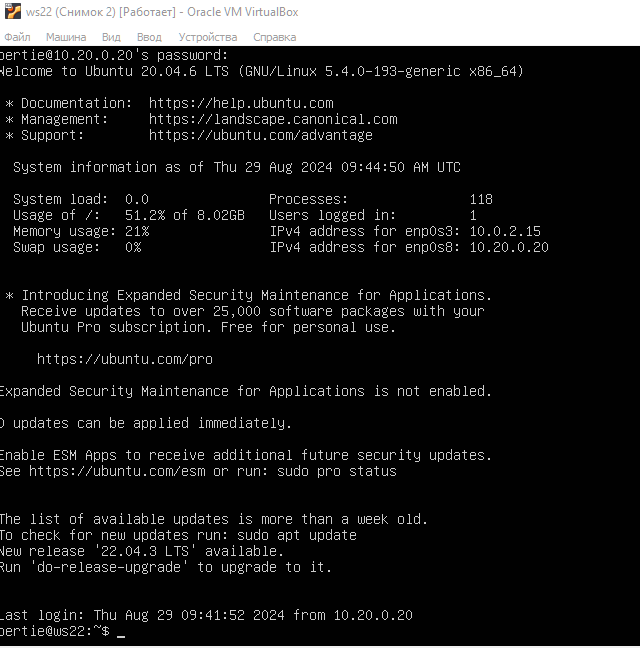

    *pic.67. Результат ssh -L 8080:127.0.0.1:80 10.20.0.20*

    - Проверяем процессы sshd:

    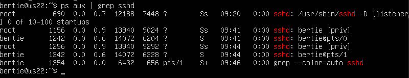

    *pic.68. Результат проверок*

    - Попытка запустить telnet на ws21:

    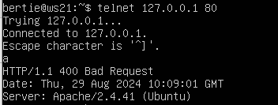

    *pic.69. Проверка подключения*

    - Убеждаемся что соединение разорвано:

    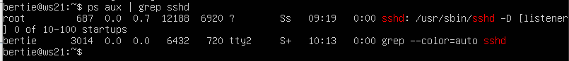

    - Воспользуемся Remote TCP на ws11 чтобы получить доступ к ws22:

    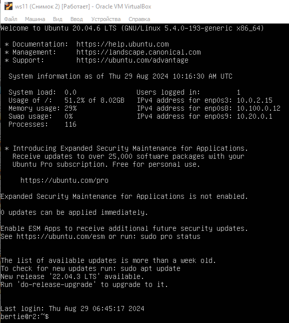

    *pic.71. Подключаемся к r2*

    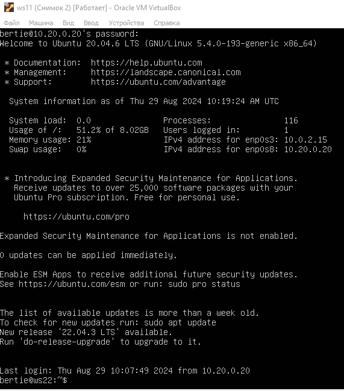

    *pic.72. Будучи на машине ws11 мы выполняем команды от имена ws22*

    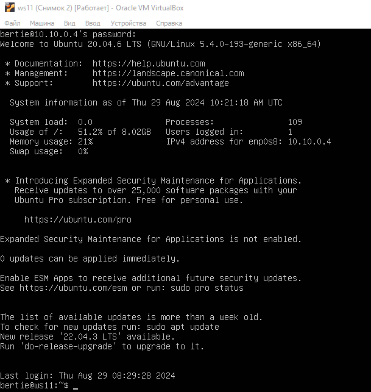

    *pic.73. Выполнение команды ssh -R 10.10.0.2:8080:127.0.0.1:80 10.10.0.2 чтобы разрешить подключение*

    - Проверяем, сработало ли полдключение:

    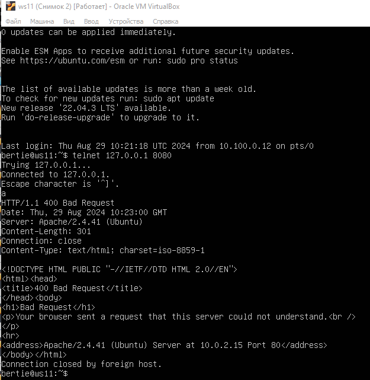

    *pic.74. Проверяем насколько сработало подключение. По строке Apache/2 понятно что сработало*

